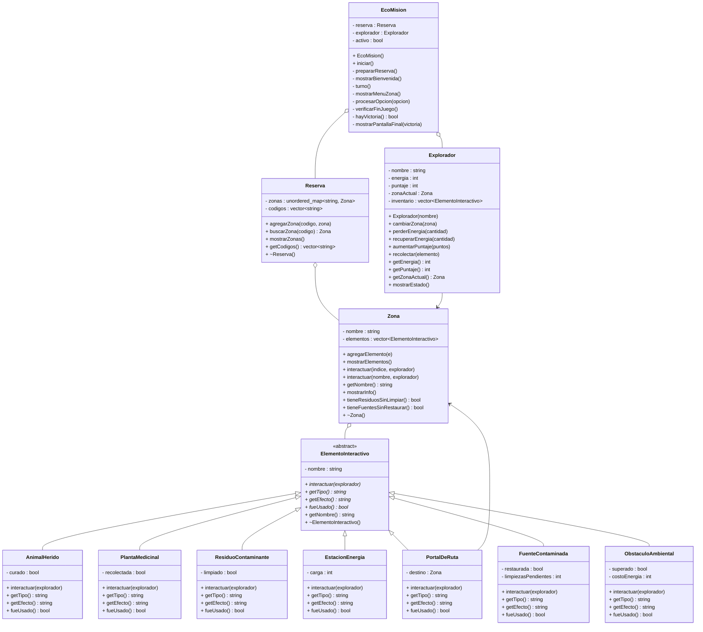

# Diseño — EcoMision

## Version inicial 

Se plantean unicamente las clases identificadas en el el documento de instrucción y relaciones principales.

```mermaid
classDiagram

    class EcoMision {
        - reserva : Reserva
        - explorador : Explorador
        + iniciar()
        - prepararReserva()
    }

    class Reserva {
        - zonas : unordered_map~string, Zona~
        + agregarZona(codigo, zona)
        + buscarZona(codigo) Zona
        + mostrarZonas()
    }

    class Zona {
        - nombre : string
        - elementos : vector~ElementoInteractivo~
        + agregarElemento(e)
        + mostrarElementos()
        + interactuar(indice, explorador)
        + interactuar(nombre, explorador)
    }

    class Explorador {
        - nombre : string
        - energia : int
        - puntaje : int
        - zonaActual : Zona
        + cambiarZona(zona)
        + perderEnergia(cantidad)
        + recuperarEnergia(cantidad)
        + aumentarPuntaje(puntos)
        + mostrarEstado()
    }

    class ElementoInteractivo {
        <<abstract>>
        - nombre : string
        + interactuar(explorador)*
    }

    class AnimalHerido {
        - curado : bool
        + interactuar(explorador)
    }

    class PlantaMedicinal {
        - recolectada : bool
        + interactuar(explorador)
    }

    class ResiduoContaminante {
        - limpiado : bool
        + interactuar(explorador)
    }

    class EstacionEnergia {
        - carga : int
        + interactuar(explorador)
    }

    class PortalDeRuta {
        - destino : Zona
        + interactuar(explorador)
    }

    class FuenteContaminada {
        - restaurada : bool
        + interactuar(explorador)
    }

    class ObstaculoAmbiental {
        - superado : bool
        + interactuar(explorador)
    }

    EcoMision o-- Reserva
    EcoMision o-- Explorador
    Reserva o-- Zona
    Zona o-- ElementoInteractivo
    Explorador --> Zona

    ElementoInteractivo <|-- AnimalHerido
    ElementoInteractivo <|-- PlantaMedicinal
    ElementoInteractivo <|-- ResiduoContaminante
    ElementoInteractivo <|-- EstacionEnergia
    ElementoInteractivo <|-- PortalDeRuta
    ElementoInteractivo <|-- FuenteContaminada
    ElementoInteractivo <|-- ObstaculoAmbiental
---

---

## Version Intermedia

- Se agregaron destructores a Reserva, Zona y ElementoInteractivo porque estas clases
  crean objetos con new y deben liberarse posteriormente para evitar fuga de .
- Se agregaron getTipo(), getEfecto() y fueUsado() como metodos virtuales puros en
  ElementoInteractivo porque Zona necesitaba mostrar informacion de cada elemento sin
  saber su tipo concreto.
- Se agrego un inventario al Explorador y el metodo recolectar().
- Se agrego el atributo activo a EcoMision para controlar el loop del juego.
- Reserva agrego el vector codigos para poder recorrer las zonas con for clasico
  sin necesitar iteradores.
- PortalDeRuta mostro su asociacion con Zona al necesitar un puntero destino.

```mermaid
classDiagram

    class EcoMision {
        - reserva : Reserva
        - explorador : Explorador
        - activo : bool
        + iniciar()
        - prepararReserva()
        - mostrarBienvenida()
        - turno()
    }

    class Reserva {
        - zonas : unordered_map~string, Zona~
        - codigos : vector~string~
        + agregarZona(codigo, zona)
        + buscarZona(codigo) Zona
        + mostrarZonas()
        + ~Reserva()
    }

    class Zona {
        - nombre : string
        - elementos : vector~ElementoInteractivo~
        + agregarElemento(e)
        + mostrarElementos()
        + interactuar(indice, explorador)
        + interactuar(nombre, explorador)
        + ~Zona()
    }

    class Explorador {
        - nombre : string
        - energia : int
        - puntaje : int
        - zonaActual : Zona
        - inventario : vector~ElementoInteractivo~
        + cambiarZona(zona)
        + perderEnergia(cantidad)
        + recuperarEnergia(cantidad)
        + aumentarPuntaje(puntos)
        + recolectar(elemento)
        + mostrarEstado()
    }

    class ElementoInteractivo {
        <<abstract>>
        - nombre : string
        + interactuar(explorador)*
        + getTipo() string*
        + getEfecto() string*
        + fueUsado() bool*
        + ~ElementoInteractivo()
    }

    class AnimalHerido {
        - curado : bool
        + interactuar(explorador)
        + getTipo() string
        + getEfecto() string
        + fueUsado() bool
    }

    class PlantaMedicinal {
        - recolectada : bool
        + interactuar(explorador)
        + getTipo() string
        + getEfecto() string
        + fueUsado() bool
    }

    class ResiduoContaminante {
        - limpiado : bool
        + interactuar(explorador)
        + getTipo() string
        + getEfecto() string
        + fueUsado() bool
    }

    class EstacionEnergia {
        - carga : int
        + interactuar(explorador)
        + getTipo() string
        + getEfecto() string
        + fueUsado() bool
    }

    class PortalDeRuta {
        - destino : Zona
        + interactuar(explorador)
        + getTipo() string
        + getEfecto() string
        + fueUsado() bool
    }

    class FuenteContaminada {
        - restaurada : bool
        + interactuar(explorador)
        + getTipo() string
        + getEfecto() string
        + fueUsado() bool
    }

    class ObstaculoAmbiental {
        - superado : bool
        + interactuar(explorador)
        + getTipo() string
        + getEfecto() string
        + fueUsado() bool
    }

    EcoMision o-- Reserva
    EcoMision o-- Explorador
    Reserva o-- Zona
    Zona o-- ElementoInteractivo
    Explorador --> Zona
    PortalDeRuta --> Zona

    ElementoInteractivo <|-- AnimalHerido
    ElementoInteractivo <|-- PlantaMedicinal
    ElementoInteractivo <|-- ResiduoContaminante
    ElementoInteractivo <|-- EstacionEnergia
    ElementoInteractivo <|-- PortalDeRuta
    ElementoInteractivo <|-- FuenteContaminada
    ElementoInteractivo <|-- ObstaculoAmbiental
```

---

## Version final 
 Se agregaron los metodos getCodigos() en Reserva, tieneResiduosSinLimpiar() y tieneFuentesSinRestaurar() en
Zona para implementar la condicion de victoria, y los getters del Explorador que
EcoMision necesita para verificar el estado del juego. FuenteContaminada agrego el
atributo limpiezasPendientes y se agrego el comportamiento especifico de Obstáculo ambiental siendo esta la ultima clase hija añadida.


---

## Matriz de decisiones de diseño

| Decision | Alternativas consideradas | Decision final | Justificacion | Riesgo si se modela mal |
|---|---|---|---|---|
| Como representar las zonas | vector, matriz, unordered_map | unordered_map + vector de codigos | La reserva busca zonas por codigo. El vector de codigos permite recorrerlas con un for clasico sin iteradores | Se complica la busqueda de una zona específica |
| Gestion de memoria | Destructores en cada clase, manual en EcoMision, | Reserva y Zona con destructores | Se tiene en cuenta que cada clase es responsable de lo que contiene por el encapsulamiento | hay fuga de memoria si los objetos creados con new no se liberan y se malgasta el espacio |
| Inventario del explorador | vector de strings, vector de punteros,  | vector de ElementoInteractivo* | Permite acceder a todos los atributos del objeto sin duplicar datos | puede haber un apuntador a un elemento inexistente si el elemento se destruye antes que el explorador |
| Elementos usados en la lista | Mostrar con marca, mostrar normal, desaparecer | Desaparecer de la lista | Retroalimentacion visual clara del progreso del jugador | El jugador puede no saber que ya interactuo con un elemento |
| Nombre del explorador | Fijo en el codigo, el usuario lo escribe, configurable por archivo | El usuario lo escribe con cin, energia fija | Se le añade un poco de personalizacion al proyecto sin complicar la configuracion inicial | Si se usara getline y cin al mismo tiempo se dañan los ciclos |
| Reutilizacion del portal | Un solo uso, reutilizable | Reutilizable | El explorador debe poder moverse libremente entre zonas | Si fuera de un solo uso el jugador se podria quedar atrapado en alguna zona |
| Condicion de victoria |  por puntaje ambiental específico, por limpiar residuos y fuentes | Limpiar todos los residuos y restaurar todas las fuentes | Objetivo concreto alineado con la tematica ambiental del proyecto | Si la condicion fuera por puntaje el jugador podria ganar sin llegar al cuidado ambiental deseado |
| Informacion de elementos | Solo nombre, nombre y tipo, nombre tipo y efecto | Nombre, tipo y efecto | El jugador necesita claridad respecto a la interacción para decidir que hacer | Sin el efecto el jugador interactua sin saber las consecuencias |
| Sobrecarga en Zona | Solo por indice, solo por nombre, ambas | Ambas: interactuar(int) e interactuar(string) | Cumple el requisito de sobrecarga del documento instructivo | Sin sobrecarga no se aplica el concepto solicitado |
| Metodos virtuales adicionales en ElementoInteractivo | Solo interactuar(), agregar getTipo y getEfecto, subclases con atributo descripcion | getTipo(), getEfecto() y fueUsado() como virtuales puros | Cada zona necesita mostrar informacion de cada elemento sin conocer su tipo concreto | Sin estos metodos Zona tendria que indagar en cada subclase y conocerla  |
