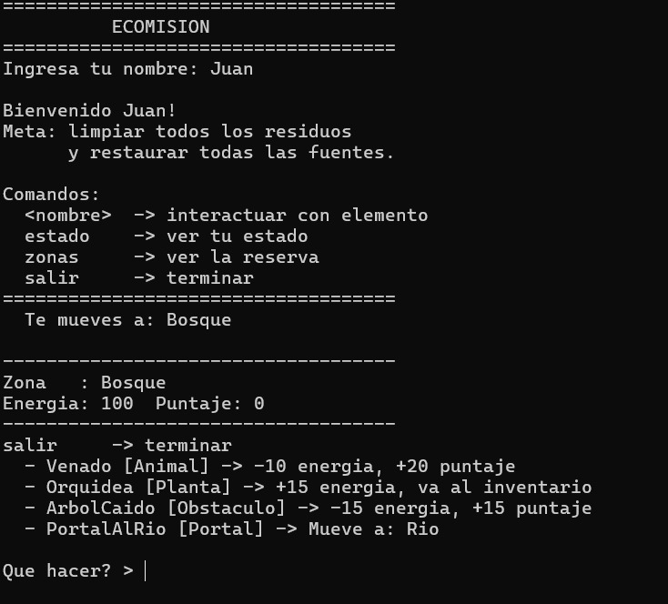
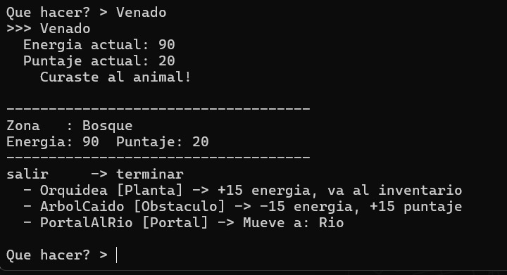
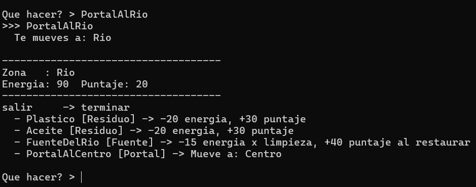

# EcoMision

## Integrantes

| Nombre | Codigo |
|---|---|
| Juan Guillermo Espinoza | 9038654 |
| Eddy Andrés Escobar Barrera | 9034626 |

## Descripcion

EcoMision es un prototipo interactivo de consola sobre cuidado ambiental desarrollado
en C++. El jugador que toma el rol de explorador recorre una reserva natural compuesta por seis zonas.
En cada zona encuentra elementos del entorno con los que puede interactuar: curar
animales heridos, limpiar residuos contaminantes, recolectar plantas medicinales,
restaurar fuentes de agua y superar obstaculos ambientales.

El objetivo es limpiar todos los residuos contaminantes y restaurar todas las fuentes
contaminadas de la reserva antes de quedarse sin energia, en cuyo caso el juego termina.

El proyecto es el trabajo final del curso de Programacion Orientada a Objetos 2026-1
de la Pontificia Universidad Javeriana Cali. 

## Como compilar y ejecutar

**Con Code::Blocks:**
1. Crear un proyecto vacio (File > New > Empty project).
2. Agregar todos los archivos .cpp de la carpeta SRC al proyecto.
3. En Project > Build options verificar que el estandar sea C++11.
4. Compilar y ejecutar con F9.

> No subir a GitHub los archivos generados por el compilador.
> Agregar un .gitignore con: *.exe, *.o, bin/ y obj/

## Archivos principales
```
##EcoMision/
├── SRC
│   ├── main.cpp                    # Punto de entrada
│   ├── EcoMision.h / .cpp          # Coordinador general y loop del juego
│   ├── Reserva.h / .cpp            # Coleccion de zonas con unordered_map
│   ├── Zona.h / .cpp               # Lugar con elementos y sobrecarga de interactuar()
│   ├── Explorador.h / .cpp         # Estado del jugador e inventario
│   ├── ElementoInteractivo.h / .cpp   # Clase abstracta base
│   └── Elementos.h / .cpp          # 7 subclases concretas
├── DOCS
│   ├── diseno.md                   # Diagramas UML en Mermaid y decisiones de diseno del proyecto
│   ├── bitacora-ia.md              # Registro de uso de IA generativa
└── README.md
```
## Conceptos de POO aplicados

| Concepto | Donde aparece en el codigo |
|---|---|
| Clase abstracta | ElementoInteractivo con interactuar(), getTipo(), getEfecto() y fueUsado() como métodos virtuales |
| Herencia | AnimalHerido, PlantaMedicinal, ResiduoContaminante, EstacionEnergia, PortalDeRuta, FuenteContaminada y ObstaculoAmbiental son clases hijas de ElementoInteractivo |
| Sobreescritura | Cada subclase implementa su propio interactuar(), getTipo(), getEfecto() y fueUsado() |
| Sobrecarga | Zona tiene interactuar(int indice, Explorador*) e interactuar(string nombre, Explorador*) |
| Polimorfismo | La clase zona llama elementos[i]->interactuar() sobre punteros ElementoInteractivo* sin saber la subclase concreta (se mantiene el encapsulamiento) |
| Asociacion | Explorador conoce su Zona* actual; PortalDeRuta conoce su Zona* destino |
| Agregacion | Reserva contiene Zona*; Zona contiene ElementoInteractivo* |
| unordered_map | Reserva indexa zonas por codigo de string para busqueda rapida |

## Imagenes del proyecto funcionando



### 2. Interacción con el Entorno (Curar Animal en el Bosque)


### 3. Cambio de Zona y Elementos de la Reserva (El Río)

